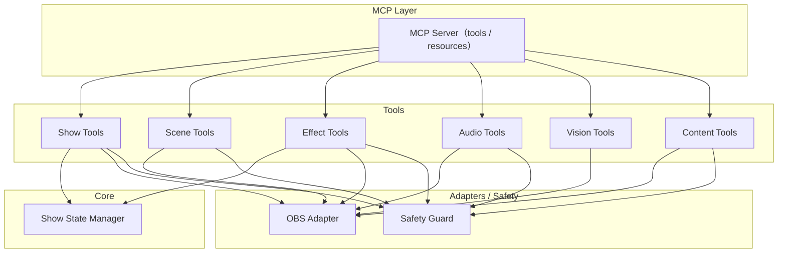
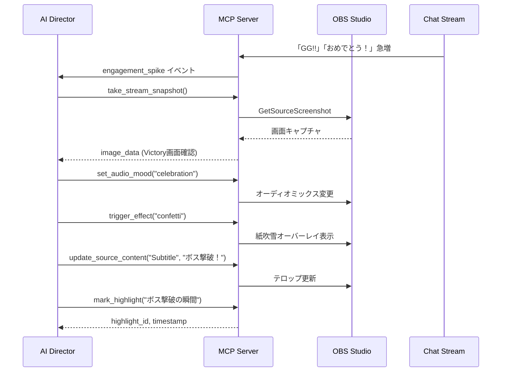

# OBS ShowRunner MCP Server – 機能仕様書

## 概要

- **プロジェクト名**: `obs-showrunner-mcp`
- **コンセプト**: 「AI Director in the Loop」
- **位置づけ**: 単なるリモコンではなく、**視覚（Vision）と聴覚（Logs/Metrics）を持ち、演出意図（Show Context）を理解してOBSを操作する自律型AIディレクター**のためのMCPサーバー

> [!IMPORTANT]
> LLMからは「演出API」として見え、OBSの低レベル操作は全てサーバー側に抽象化されます。

---

## 1. 目的・対象

### 1.1 目的

- 配信者がLLM（Claude, ChatGPT等）と組み合わせて、番組進行・シーン切り替え・オーバーレイ・BGM・エフェクトを**「演出レベルの意図」**で制御できるようにする
- OBS WebSocketの低レベルAPIをMCPサーバー内で抽象化し、「ショー／演出API」として提供

### 1.2 対象ユーザー

- OBS Studioを使っている個人配信者／小規模スタジオ
- MCP対応クライアント（Claude Desktop / 任意のMCPクライアント）

### 1.3 前提環境

| 項目 | 要件 |
|------|------|
| OBS Studio | 31+（obs-websocket有効） |
| ランタイム | Node.js 20+（TypeScript推奨） |
| プロトコル | MCP準拠（JSON-RPC over stdio） |

---

## 2. 想定ユースケース

### 2.1 一人雑談配信

配信者「今日の配信は3トピック。区切りごとにタイトルテロップとBGM切り替えお願い」

**AIの動作:**
1. ショーテンプレを生成
2. ASRテキストからトピック切り替えを検出
3. `switch_segment` / `show_overlay` / `trigger_effect` で演出

### 2.2 ゲーム配信

視聴者の盛り上がり（コメント量・絵文字・スパチャ）をメトリクス化し、閾値を超えた際に:

- ハイライトマーカー（切り抜き用）付与
- ド派手なトランジション演出
- **AIが `take_stream_snapshot` で「Victory」画面を視覚的に検知**
- 勝利ファンファーレBGMへ自動切替、紙吹雪エフェクト

### 2.3 勉強／作業配信

配信者「ポモドーロ25分で集中モード。休憩は5分」

**AIの動作:**
- ショーに「集中」「休憩」セグメントを定義
- タイマーオーバーレイ、BGM、レイアウトを自動切替

---

## 3. アーキテクチャ

### 3.1 モジュール構成



### 3.2 各モジュールの役割

| モジュール | 役割 |
|-----------|------|
| **MCP Server** | MCP tools/resources の登録と LLM からの呼び出しルーティング |
| **Show State Manager** | ショーテンプレート・現在セグメント・タイマー・オーバーレイの状態保持 |
| **OBS Adapter** | obs-websocket への接続と低レベル操作のラッパー |
| **Show / Scene / Effect / Audio / Vision / Content Tools** | 各演出 API の実装（シーン切替、エフェクト、音響、スクリーンショット、テロップ更新） |
| **Safety Guard** | 危険操作のブロック、dry-run（debug モード）、safety mode の昇格防止 |

---

## 4. 機能一覧

### 4.1 ショー管理

- 組み込みショーテンプレート `default`（opening / main / ending）によるショー進行
- セグメント（オープニング、雑談、ゲーム、エンディング等）の定義
- 各セグメントに紐づく: OBS シーン名 / タイマー設定

### 4.2 演出制御（高レベルAPI）

| カテゴリ | 機能 |
|---------|------|
| 進行管理 | `start_show`, `end_show`, `switch_segment`, `extend_segment`, `get_current_show_state`, `get_show_templates` |
| エフェクト | `trigger_effect` |
| オーバーレイ | `show_overlay`, `hide_overlay` |
| ハイライト | `mark_highlight`, `get_highlights` |
| 視覚確認 | `take_stream_snapshot` |
| 動的コンテンツ | `update_source_content` |
| 音響演出 | `set_audio_mood` |
| シーン操作 | `get_scene_list`, `set_scene` |

### 4.3 セーフティ・モニタリング

- 危険操作のブロック（safety mode）と dry-run（debug モード）
- OBSヘルスチェック (`get_obs_health`)
- 再接続 (`reconnect_obs`)、設定確認 (`get_debug_config`)

---

## 5. MCP インターフェース仕様

### 5.1 Resources（状態参照用）

LLMが常に「現在の状況」を把握できるように、以下のデータをリソースとして公開する。

> [!TIP]
> Resourceを活用することで、Tool呼び出しの往復を削減し、Context Windowを節約できます。

| URI | 内容 |
|-----|------|
| `obs://state/current` | 現在のセグメント、残り時間、オーバーレイ状態を含むJSON |

### 5.2 Tools 一覧

#### 5.2.1 ショー／セグメント関連

**1. `start_show`**

| 項目 | 内容 |
|------|------|
| 目的 | ショーを開始し、開始セグメントへ切り替える |
| 入力 | `show_template_id?: string`（省略時 `default`）, `options?: { skip_opening?: boolean; start_segment_id?: string }` |
| 出力 | `success: boolean`, `current_segment: SegmentState` |
| 挙動 | ショーテンプレ読み込み → 開始セグメントに `defaultSceneName` があれば OBS シーンを切り替え |

**2. `end_show`**

| 項目 | 内容 |
|------|------|
| 目的 | ショーを終了し、エンディング演出＋後処理を行う |
| 入力 | `options?: { play_ending?: boolean; stop_streaming?: boolean; stop_recording?: boolean }` |
| 出力 | `success: boolean` |
| 挙動 | エンディングセグメントへ切り替え → オプションに応じて配信・録画停止 |

**3. `switch_segment`**

| 項目 | 内容 |
|------|------|
| 目的 | セグメント（番組の章）を切り替える |
| 入力 | `segment_id: string`, `options?: { smooth_transition?: boolean; transition_duration_ms?: number (50-20000) }` |
| 出力 | `success: boolean`, `current_segment: SegmentState`, `transition_applied?: boolean` |
| 挙動 | セグメントに紐づくシーンへ切り替え。`smooth_transition` 時はフェードトランジションを適用（OBS のトランジション種別 `fade_transition` をロケール非依存で検索） |

**4. `extend_segment`**

| 項目 | 内容 |
|------|------|
| 目的 | 現在のセグメントの予定時間を延長する |
| 入力 | `minutes: number`（1-120） |
| 出力 | `success: boolean`, `timer_remaining_sec: number` |
| 理由 | 話が盛り上がった際、AIが自律的に「次のコーナーを遅らせる」判断を反映 |

**5. `get_current_show_state`**

| 項目 | 内容 |
|------|------|
| 目的 | 現在のショー状態を取得 |
| 入力 | なし |
| 出力 | `show_id`, `current_segment`, `segments[]`, `overlays[]`, `timers[]` |

**6. `get_show_templates`**

| 項目 | 内容 |
|------|------|
| 目的 | 登録済みショーテンプレートとそのセグメント一覧を取得 |
| 入力 | なし |
| 出力 | `templates: ShowTemplate[]` |

---

#### 5.2.2 視覚・確認（Vision）

**7. `take_stream_snapshot`**

| 項目 | 内容 |
|------|------|
| 目的 | 現在の配信画面（または特定のソース）を画像として取得 |
| 入力 | `source_name?: string`（省略時は現在のプログラムシーン）, `image_format?: "jpg" \| "png"`（デフォルト jpg）, `image_width?: number`（8-4096、デフォルト 1280） |
| 出力 | MCP image content（Base64 + mimeType）。デフォルトは 1280px JPEG に縮小しコンテキスト消費を抑制 |
| ユースケース | 「今の画面、ごちゃごちゃしてない？」「ゲームでVictory画面が出たら教えて」 |

> [!NOTE]
> この機能により、AIが「現在の画面がどうなっているか」を視覚的に確認して演出を決定できます。テロップの被り確認、カメラ映りの適切さ、ゲーム画面の状況判断などが可能になります。

---

#### 5.2.3 動的コンテンツ（Dynamic Content）

**8. `update_source_content`**

| 項目 | 内容 |
|------|------|
| 目的 | シーン内の特定ソースの内容をリアルタイムに更新 |
| 入力 | `source_name: string`, `content: string`, `properties?: object` |
| 出力 | `success: boolean` |
| 挙動 | 指定されたソースの種類（Text/Browser/Image）を自動判別して更新 |
| ユースケース | 「今の話題を画面左上にテロップとして出す」「視聴者のコメントをピックアップ」 |

---

#### 5.2.4 演出エフェクト関連

**9. `trigger_effect`**

| 項目 | 内容 |
|------|------|
| 目的 | 演出エフェクトを発火 |
| 入力 | `effect_type: string`, `duration_sec?: number`（デフォルト 5）, `auto_revert?: boolean`（デフォルト true） |
| 出力 | `success: boolean` |
| 挙動 | 現在のプログラムシーン内の `effect_type` と同名のシーンアイテムを有効化し、`duration_sec` 経過後に自動で無効化 |

> [!TIP]
> `duration_sec`と`auto_revert`オプションにより、「5秒間だけ演出をして自動で元に戻す」操作をサーバー側で完結でき、LLMのToken消費とレイテンシを削減できます。

**10. `show_overlay`**

| 項目 | 内容 |
|------|------|
| 目的 | オーバーレイを表示 |
| 入力 | `overlay_id: string`, `params?: object` |
| 出力 | `success: boolean` |
| 挙動 | 現在のプログラムシーン内の `overlay_id` と同名のシーンアイテムを有効化 |

**11. `hide_overlay`**

| 項目 | 内容 |
|------|------|
| 目的 | オーバーレイを非表示 |
| 入力 | `overlay_id: string` |
| 出力 | `success: boolean` |
| 挙動 | 現在のプログラムシーン内の `overlay_id` と同名のシーンアイテムを無効化 |

**12. `mark_highlight`**

| 項目 | 内容 |
|------|------|
| 目的 | 現在の配信時刻にハイライトマーカーを付与 |
| 入力 | `description?: string` |
| 出力 | `success: boolean`, `highlight_id: string`, `timestamp: number` |

**13. `get_highlights`**

| 項目 | 内容 |
|------|------|
| 目的 | 記録済みハイライトマーカーの一覧を取得 |
| 入力 | なし |
| 出力 | `highlights: Highlight[]` |

---

#### 5.2.5 音響演出（Audio）

**14. `set_audio_mood`**

| 項目 | 内容 |
|------|------|
| 目的 | 配信の雰囲気に合わせてオーディオミックスを一括変更 |
| 入力 | `mood: "talk" \| "game_focus" \| "hype" \| "cinema" \| "celebration" \| "mute_all"` |
| 出力 | `success: boolean`（一部の入力で失敗した場合は `applied` / `failed` で内訳を報告） |
| 挙動 | 事前定義されたプロファイルに基づき、マイク・BGM・ゲーム音・SEの音量を並列で一括適用 |

**プロファイル例:**

| Mood | マイク | BGM | ゲーム音 | SE |
|------|--------|-----|----------|-----|
| talk | 100% | 30% | 20% | 50% |
| game_focus | 80% | 20% | 100% | 80% |
| hype | 100% | 80% | 60% | 100% |
| cinema | 50% | 100% | 80% | 30% |

---

#### 5.2.6 シーン操作関連

**15. `get_scene_list`**

| 項目 | 内容 |
|------|------|
| 目的 | 利用可能なシーン一覧と現在のプログラムシーンを取得 |
| 入力 | なし |
| 出力 | `current_program_scene_name`, `scenes[]` |

**16. `set_scene`**

| 項目 | 内容 |
|------|------|
| 目的 | プログラムシーンを切り替え |
| 入力 | `scene_name: string` |
| 出力 | `success: boolean` |

---

#### 5.2.7 セーフティ・モニタリング関連

**17. `get_obs_health`**

| 項目 | 内容 |
|------|------|
| 目的 | OBS接続状態／負荷状況の取得 |
| 入力 | なし |
| 出力 | `connected`, `obs_version`, `cpu_usage`, `fps`, `dropped_frames` |

**18. `set_safety_mode`**

| 項目 | 内容 |
|------|------|
| 目的 | セーフティ設定の変更（開発時のみ推奨） |
| 入力 | `mode: "strict" \| "normal" \| "debug"` |
| 出力 | `success: boolean` |
| 挙動 | `strict`: 危険操作を全ブロック / `normal`: 設定で許可されたもののみ / `debug`: dry-run（OBS操作をスキップ） |
| 制約 | 起動時の `SAFETY_MODE`（baseline）より緩いモードへの変更は拒否される（緩和は環境変数経由のみ） |

**19. `reconnect_obs`**

| 項目 | 内容 |
|------|------|
| 目的 | OBS WebSocket への再接続 |
| 入力 | なし |
| 出力 | `success: boolean` |

**20. `get_debug_config`**

| 項目 | 内容 |
|------|------|
| 目的 | 接続トラブルシュート用のマスク済み設定の取得 |
| 入力 | なし |
| 出力 | `url`, `password_set`, `cwd`, `node_version` |

---

## 6. データモデル仕様

### 6.1 ShowTemplate

```typescript
type ShowTemplate = {
  id: string;
  name: string;
  description?: string;
  segments: SegmentTemplate[];
};
```

### 6.2 SegmentTemplate

```typescript
type SegmentTemplate = {
  id: string;
  name: string;
  type: "opening" | "talk" | "game" | "ending" | string;
  default_scene_name?: string;
  timer_sec?: number;
};
```

### 6.3 AudioMood

```typescript
type AudioMood = "talk" | "game_focus" | "hype" | "cinema" | "celebration" | "mute_all";
```

### 6.4 その他

```typescript
type OverlayState = {
  id: string;
  visible: boolean;
  params: object;
};

type Highlight = {
  id: string;
  description?: string;
  timestamp: number;
};
```

---

## 7. セーフティ仕様

> [!CAUTION]
> デフォルトは `mode: "strict"` です。配信停止などの危険操作は明示的に許可が必要です。

### 危険操作カテゴリ

- 配信停止
- 録画停止
- 録画ファイル削除
- シーン／プロファイル削除

### 制御ポリシー

| モード | 動作 |
|--------|------|
| `strict` | 危険操作を全ブロック |
| `normal` | 設定で許可されたもののみ実行 |
| `debug` | dry-run — OBSを変更する操作をスキップし、結果に `dryRun: true` を付与 |

実行時の `set_safety_mode` は、起動時に設定された baseline より緩いモードへの
変更を拒否する（緩和度: `debug` < `strict` < `normal`）。

---

## 8. 設定・デプロイ

### 8.1 設定（環境変数）

```bash
OBS_WEBSOCKET_URL=ws://localhost:4455
OBS_WEBSOCKET_PASSWORD=your_password

SAFETY_MODE=strict            # strict / normal / debug
ALLOW_STOP_STREAMING=false
ALLOW_STOP_RECORDING=false

OBS_MIC_INPUT_NAME=Mic/Aux
OBS_BGM_INPUT_NAME=BGM
OBS_GAME_INPUT_NAME=Game Audio
OBS_SE_INPUT_NAME=Sound Effects
```

MCPクライアントから渡された環境変数が常に優先され、ローカルの `.env` は
開発時のフォールバックとしてのみ読み込まれる。

### 8.2 実行

```bash
# npx での実行
npx obs-showrunner-mcp

# MCP用の config.json にサーバー定義を追記してクライアントから利用
```

---

## 9. 開発ロードマップ

### Phase 1: MVP (Core Control)

- [x] OBS WebSocket接続と基本抽象化
- [x] `start_show` / `end_show`
- [x] `switch_segment`
- [x] Resourceによる `current_state` 提供
- [x] 基本的なセーフティ機能

### Phase 2: Engagement & Dynamics (Reactive)

- [x] `update_source_content`（テロップ更新）
- [ ] `get_engagement_metrics` とイベントループ
- [x] `set_audio_mood`
- [x] `trigger_effect`
- [x] `show_overlay` / `hide_overlay`
- [x] `mark_highlight`
- [ ] `wait_for_event`

### Phase 3: Vision & Autonomy (Pro Director)

- [x] `take_stream_snapshot`（Vision）の実装 ← **差別化ポイント**
- [ ] AIによる自動クリップ生成連携
- [ ] 高度なレイアウトテンプレート管理

---

## 10. AIディレクター自律動作シナリオ

### シナリオ: ゲーム配信でボス撃破

**状況:** ゲーム配信中、ボス戦でプレイヤーが勝利した直後



---

## 11. 将来拡張（オプション）

- 自動クリップ生成ワークフロー（配信後にハイライトから動画切り出し）
- 複数OBSインスタンス対応（マルチPC配信）
- ライブコメントを使った投票／アンケートオーバーレイ
- スポンサー読み用テンプレと自動テロップ生成
- ASR（音声認識）との連携強化

---

## 12. 技術スタックの推奨

| 項目 | 推奨 | 理由 |
|------|------|------|
| 言語 | TypeScript | `obs-websocket-js`が最も成熟、MCP SDKも公式対応 |
| ランタイム | Node.js 20+ | 非同期処理との親和性 |
| 代替 | Python | AI系ライブラリとの親和性が高いが、WebSocket非同期処理がやや複雑 |
