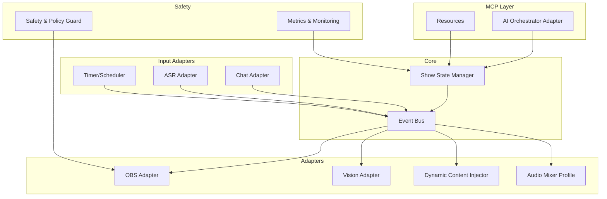
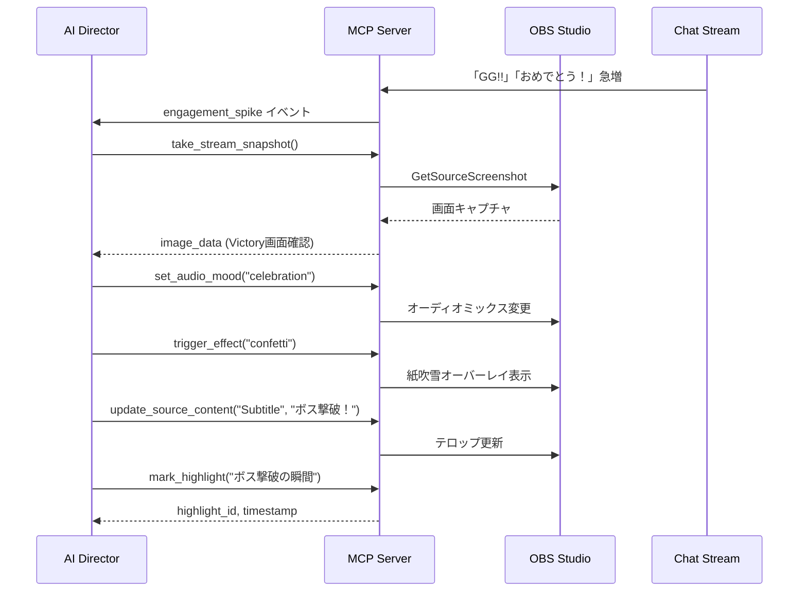

# OBS ShowRunner MCP Server – 機能仕様書

## 概要

- **プロジェクト名**: `obs-showrunner-mcp`
- **コンセプト**: 「AI Director in the Loop」
- **位置づけ**: 単なるリモコンではなく、**視覚（Vision）と聴覚（Logs/Metrics）を持ち、演出意図（Show Context）を理解してOBSを操作する自律型AIディレクター**のためのMCPサーバー

> [!IMPORTANT]
> LLMからは「演出API」として見え、OBSの低レベル操作は全てサーバー側に抽象化されます。

---

## 1. 目的・対象

### 1.1 目的

- 配信者がLLM（Claude, ChatGPT等）と組み合わせて、番組進行・シーン切り替え・オーバーレイ・BGM・エフェクトを**「演出レベルの意図」**で制御できるようにする
- OBS WebSocketの低レベルAPIをMCPサーバー内で抽象化し、「ショー／演出API」として提供

### 1.2 対象ユーザー

- OBS Studioを使っている個人配信者／小規模スタジオ
- MCP対応クライアント（Claude Desktop / 任意のMCPクライアント）

### 1.3 前提環境

| 項目 | 要件 |
|------|------|
| OBS Studio | 31+（obs-websocket有効） |
| ランタイム | Node.js 18+（TypeScript推奨） |
| プロトコル | MCP準拠（JSON-RPC over stdio or TCP） |

---

## 2. 想定ユースケース

### 2.1 一人雑談配信

配信者「今日の配信は3トピック。区切りごとにタイトルテロップとBGM切り替えお願い」

**AIの動作:**
1. ショーテンプレを生成
2. ASRテキストからトピック切り替えを検出
3. `switch_segment` / `show_overlay` / `trigger_effect` で演出

### 2.2 ゲーム配信

視聴者の盛り上がり（コメント量・絵文字・スパチャ）をメトリクス化し、閾値を超えた際に:

- ハイライトマーカー（切り抜き用）付与
- ド派手なトランジション演出
- **AIが `take_stream_snapshot` で「Victory」画面を視覚的に検知**
- 勝利ファンファーレBGMへ自動切替、紙吹雪エフェクト

### 2.3 勉強／作業配信

配信者「ポモドーロ25分で集中モード。休憩は5分」

**AIの動作:**
- ショーに「集中」「休憩」セグメントを定義
- タイマーオーバーレイ、BGM、レイアウトを自動切替

---

## 3. アーキテクチャ

### 3.1 モジュール構成



### 3.2 各モジュールの役割

| モジュール | 役割 |
|-----------|------|
| **Show State Manager** | ショー構成・現在セグメント・残り時間・レイアウト・オーバーレイの状態保持 |
| **Event Bus** | OBS状態・チャット・ASR・タイマーからのイベント受信・配送 |
| **AI Orchestrator Adapter** | MCP tools/resources実装、LLMからの呼び出しをルーティング |
| **OBS Adapter** | obs-websocketへの接続と低レベル操作のラッパー |
| **Vision Adapter** | `GetSourceScreenshot` APIで現在のプログラム映像を提供 |
| **Dynamic Content Injector** | Text GDI+やBrowser Sourceを動的に書き換え |
| **Audio Mixer Profile** | ムード定義に基づく一括ミキシング制御 |
| **Safety & Policy Guard** | 危険操作の制限、2段階確認、操作ログ管理 |
| **Metrics & Monitoring** | メトリクス算出、ステータス取得API |

---

## 4. 機能一覧

### 4.1 ショー管理

- ショーの作成・ロード・保存
- セグメント（オープニング、雑談、ゲーム、エンディング等）の定義
- 各セグメントに紐づく: シーンレイアウト / BGMプリセット / オーバーレイ構成 / タイマー設定

### 4.2 演出制御（高レベルAPI）

| カテゴリ | 機能 |
|---------|------|
| 進行管理 | `start_show`, `end_show`, `switch_segment`, `extend_segment` |
| エフェクト | `trigger_effect` |
| オーバーレイ | `show_overlay`, `hide_overlay` |
| ハイライト | `mark_highlight` |
| 視覚確認 | `take_stream_snapshot` |
| 動的コンテンツ | `update_source_content` |
| 音響演出 | `set_audio_mood` |

### 4.3 レイアウトテンプレート

- シーンレイアウトの宣言的定義（JSON）
- 現在構成のエクスポート／インポート
- 差分適用（既存シーンとの比較・変更）

### 4.4 イベント／メトリクス

- 盛り上がりメトリクス算出 (`get_engagement_metrics`)
- イベント待機 (`wait_for_event`)

### 4.5 セーフティ・モニタリング

- 操作ごとの権限レベル設定
- 危険操作のブロック／確認
- OBSヘルスチェック (`get_obs_health`)
- ランタイム統計 (`get_runtime_stats`)

---

## 5. MCP インターフェース仕様

### 5.1 Resources（状態参照用）

LLMが常に「現在の状況」を把握できるように、以下のデータをリソースとして公開する。

> [!TIP]
> Resourceを活用することで、Tool呼び出しの往復を削減し、Context Windowを節約できます。

| URI | 内容 |
|-----|------|
| `obs://state/current` | 現在のセグメント、残り時間、アクティブなシーン名を含むJSON |
| `obs://logs/chat/recent` | 直近30件のチャットログ（要約・感情分析用） |
| `obs://catalog/overlays` | 利用可能なオーバーレイIDとそのパラメータスキーマ一覧 |
| `obs://catalog/effects` | 利用可能なエフェクトタイプ一覧 |

### 5.2 Tools 一覧

#### 5.2.1 ショー／セグメント関連

**1. `start_show`**

| 項目 | 内容 |
|------|------|
| 目的 | ショーを開始し、オープニング演出を実行 |
| 入力 | `show_template_id?: string`, `options?: { skip_opening?: boolean; start_segment_id?: string }` |
| 出力 | `success: boolean`, `current_segment: SegmentState` |
| 挙動 | ショーテンプレ読み込み → OBSシーン／音声を初期化 → オープニング演出実行 |

**2. `end_show`**

| 項目 | 内容 |
|------|------|
| 目的 | ショーを終了し、エンディング演出＋後処理を行う |
| 入力 | `options?: { play_ending?: boolean; stop_streaming?: boolean; stop_recording?: boolean }` |
| 出力 | `success: boolean` |
| 挙動 | エンディングセグメントへ切り替え → オプションに応じて配信・録画停止 |

**3. `switch_segment`**

| 項目 | 内容 |
|------|------|
| 目的 | セグメント（番組の章）を切り替える |
| 入力 | `segment_id: string`, `options?: { smooth_transition?: boolean; transition_duration_ms?: number }` |
| 出力 | `success: boolean`, `current_segment: SegmentState` |
| 挙動 | 対応するシーンレイアウト／オーバーレイ／BGMを適用・切り替え |

**4. `extend_segment`**

| 項目 | 内容 |
|------|------|
| 目的 | 現在のセグメントの予定時間を延長する |
| 入力 | `minutes: number` |
| 出力 | `success: boolean`, `new_end_time: number` |
| 理由 | 話が盛り上がった際、AIが自律的に「次のコーナーを遅らせる」判断を反映 |

**5. `get_current_show_state`**

| 項目 | 内容 |
|------|------|
| 目的 | 現在のショー状態を取得 |
| 入力 | なし |
| 出力 | `show_id`, `current_segment`, `segments[]`, `overlays[]`, `timers[]` |

---

#### 5.2.2 視覚・確認（Vision）

**6. `take_stream_snapshot`**

| 項目 | 内容 |
|------|------|
| 目的 | 現在の配信画面（または特定のソース）を画像として取得 |
| 入力 | `source_name?: string`（省略時はProgram Out） |
| 出力 | `image_data: string`（Base64 encoded image） |
| ユースケース | 「今の画面、ごちゃごちゃしてない？」「ゲームでVictory画面が出たら教えて」 |

> [!NOTE]
> この機能により、AIが「現在の画面がどうなっているか」を視覚的に確認して演出を決定できます。テロップの被り確認、カメラ映りの適切さ、ゲーム画面の状況判断などが可能になります。

---

#### 5.2.3 動的コンテンツ（Dynamic Content）

**7. `update_source_content`**

| 項目 | 内容 |
|------|------|
| 目的 | シーン内の特定ソースの内容をリアルタイムに更新 |
| 入力 | `source_name: string`, `content: string`, `properties?: object` |
| 出力 | `success: boolean` |
| 挙動 | 指定されたソースの種類（Text/Browser/Image）を自動判別して更新 |
| ユースケース | 「今の話題を画面左上にテロップとして出す」「視聴者のコメントをピックアップ」 |

---

#### 5.2.4 演出エフェクト関連

**8. `trigger_effect`**

| 項目 | 内容 |
|------|------|
| 目的 | 抽象化された演出エフェクトを発火 |
| 入力 | `effect_type: "hype" \| "focus" \| "alert" \| "celebration" \| "confetti" \| string`, `intensity?: number` (0.0–1.0), `duration_sec?: number`, `auto_revert?: boolean`, `message?: string` |
| 出力 | `success: boolean` |
| 挙動例 | `hype`: カメラズーム、BGMボリュームUP、パーティクルオーバーレイ / `focus`: 背景を暗くし話者を強調 |

> [!TIP]
> `duration`と`auto_revert`オプションにより、「5秒間だけフォーカス演出をして自動で元に戻す」操作をサーバー側で完結でき、LLMのToken消費とレイテンシを削減できます。

**9. `show_overlay`**

| 項目 | 内容 |
|------|------|
| 目的 | オーバーレイを表示 |
| 入力 | `overlay_id: string`, `params?: object`（タイトル、本文、色などテンプレ依存） |
| 出力 | `success: boolean`, `overlay_state: OverlayState` |

**10. `hide_overlay`**

| 項目 | 内容 |
|------|------|
| 目的 | オーバーレイを非表示 |
| 入力 | `overlay_id: string` |
| 出力 | `success: boolean` |

**11. `mark_highlight`**

| 項目 | 内容 |
|------|------|
| 目的 | 現在の配信時刻にハイライトマーカーを付与 |
| 入力 | `description?: string` |
| 出力 | `success: boolean`, `highlight_id: string`, `timestamp: number` |

---

#### 5.2.5 音響演出（Audio）

**12. `set_audio_mood`**

| 項目 | 内容 |
|------|------|
| 目的 | 配信の雰囲気に合わせてオーディオミックスを一括変更 |
| 入力 | `mood: "talk" \| "game_focus" \| "hype" \| "cinema" \| "celebration" \| "mute_all"`, `fade_duration_ms?: number` (デフォルト 2000) |
| 出力 | `success: boolean` |
| 挙動 | 事前定義されたプロファイルに基づき、マイク・BGM・ゲーム音・SEのバランスをクロスフェード |

**プロファイル例:**

| Mood | マイク | BGM | ゲーム音 | SE |
|------|--------|-----|----------|-----|
| talk | 100% | 30% | 20% | 50% |
| game_focus | 80% | 20% | 100% | 80% |
| hype | 100% | 80% | 60% | 100% |
| cinema | 50% | 100% | 80% | 30% |

---

#### 5.2.6 レイアウト／テンプレート関連

**13. `apply_layout`**

| 項目 | 内容 |
|------|------|
| 目的 | シーンレイアウトテンプレートを適用 |
| 入力 | `layout: LayoutTemplate`, `options?: { target_scene?: string; dry_run?: boolean }` |
| 出力 | `success: boolean`, `diff?: LayoutDiff`（dry_run時） |
| 挙動 | 現在のOBSシーン構成との差分を計算し、必要な変更のみを適用 |

**14. `export_layout`**

| 項目 | 内容 |
|------|------|
| 目的 | 現在のシーン構成をテンプレートとしてエクスポート |
| 入力 | `target_scene?: string` |
| 出力 | `layout: LayoutTemplate` |

**15. `load_show_template`**

| 項目 | 内容 |
|------|------|
| 目的 | ショーテンプレートをロード |
| 入力 | `show_template_id: string` |
| 出力 | `show_template: ShowTemplate` |

**16. `save_show_template`**

| 項目 | 内容 |
|------|------|
| 目的 | 現在のショー状態をテンプレートとして保存 |
| 入力 | `show_template_id: string`, `show_template: ShowTemplate` |
| 出力 | `success: boolean` |

---

#### 5.2.7 メトリクス／イベント関連

**17. `get_engagement_metrics`**

| 項目 | 内容 |
|------|------|
| 目的 | 視聴者の盛り上がり指標を取得 |
| 入力 | `window_sec?: number`（デフォルト 60） |
| 出力 | `comments_per_min`, `unique_viewers`, `donation_count`, `donation_amount`, `emoji_ratio`, `engagement_score` (0.0–1.0) |

**18. `wait_for_event`**

| 項目 | 内容 |
|------|------|
| 目的 | 指定イベントの発生を待機 |
| 入力 | `event_types: string[]`（例: ["engagement_spike", "keyword_detected"]）, `timeout_sec?: number` |
| 出力 | `event?: Event`（タイムアウト時はnull） |
| 備考 | MCPではブロッキング呼び出しだが、クライアント側でポーリング／並列実行前提 |

---

#### 5.2.8 セーフティ・モニタリング関連

**19. `get_obs_health`**

| 項目 | 内容 |
|------|------|
| 目的 | OBS接続状態／負荷状況の取得 |
| 入力 | なし |
| 出力 | `connected`, `obs_version`, `cpu_usage`, `fps`, `dropped_frames` |

**20. `get_runtime_stats`**

| 項目 | 内容 |
|------|------|
| 目的 | MCPサーバーのランタイム統計 |
| 入力 | なし |
| 出力 | `uptime_sec`, `tool_call_counts`, `errors_last_10min` |

**21. `set_safety_mode`**

| 項目 | 内容 |
|------|------|
| 目的 | セーフティ設定の変更（開発時のみ推奨） |
| 入力 | `mode: "strict" \| "normal" \| "debug"` |
| 出力 | `success: boolean` |
| 挙動 | `strict`: 危険操作を全ブロック / `normal`: 設定で許可されたもののみ / `debug`: dry-runデフォルトON |

---

## 6. データモデル仕様

### 6.1 ShowTemplate

```typescript
type ShowTemplate = {
  id: string;
  name: string;
  description?: string;
  segments: SegmentTemplate[];
  default_bgm_profile?: string;
  default_audio_mood?: AudioMood;
};
```

### 6.2 SegmentTemplate

```typescript
type SegmentTemplate = {
  id: string;
  name: string;
  type: "opening" | "talk" | "game" | "ending" | string;
  default_layout_id: string;
  default_overlays?: string[];
  default_audio_mood?: AudioMood;
  timer_sec?: number;
};
```

### 6.3 LayoutTemplate

```typescript
type LayoutTemplate = {
  id: string;
  name: string;
  scene_name: string;
  sources: LayoutSource[];
  audio?: LayoutAudioConfig[];
};
```

### 6.4 AudioMood

```typescript
type AudioMood = "talk" | "game_focus" | "hype" | "cinema" | "celebration" | "mute_all";
```

### 6.5 その他

```typescript
type OverlayState = {
  id: string;
  visible: boolean;
  params: object;
};

type EffectPreset = {
  effect_type: string;
  operations: OBSOperation[];
  duration_sec?: number;
  auto_revert?: boolean;
};

type Event = {
  type: string;
  timestamp: number;
  payload: object;
};
```

---

## 7. セーフティ仕様

> [!CAUTION]
> デフォルトは `mode: "strict"` です。配信停止などの危険操作は明示的に許可が必要です。

### 危険操作カテゴリ

- 配信停止
- 録画停止
- 録画ファイル削除
- シーン／プロファイル削除

### 制御ポリシー

| モード | 動作 |
|--------|------|
| `strict` | 危険操作を全ブロック |
| `normal` | 設定で許可されたもののみ実行 |
| `debug` | dry-runをデフォルトON（内部ログのみ） |

---

## 8. 設定・デプロイ

### 8.1 設定ファイル例（YAML）

```yaml
obs:
  websocket_url: "ws://localhost:4455"
  password: "your_password"

safety:
  mode: "strict"
  allow_stop_streaming: false
  allow_stop_recording: true

chat:
  provider: "youtube"  # or "twitch" / "none"
  api_key: "..."

audio:
  moods:
    talk:
      mic: 1.0
      bgm: 0.3
      game: 0.2
      se: 0.5
    hype:
      mic: 1.0
      bgm: 0.8
      game: 0.6
      se: 1.0

metrics:
  window_sec: 60

logging:
  level: "info"
```

### 8.2 実行

```bash
# npx での実行
npx obs-showrunner-mcp

# MCP用の config.json にサーバー定義を追記してクライアントから利用
```

---

## 9. 開発ロードマップ

### Phase 1: MVP (Core Control)

- [ ] OBS WebSocket接続と基本抽象化
- [ ] `start_show` / `end_show`
- [ ] `switch_segment`
- [ ] Resourceによる `current_state` 提供
- [ ] 基本的なセーフティ機能

### Phase 2: Engagement & Dynamics (Reactive)

- [ ] `update_source_content`（テロップ更新）
- [ ] `get_engagement_metrics` とイベントループ
- [ ] `set_audio_mood`
- [ ] `trigger_effect`
- [ ] `show_overlay` / `hide_overlay`
- [ ] `mark_highlight`
- [ ] `wait_for_event`

### Phase 3: Vision & Autonomy (Pro Director)

- [ ] `take_stream_snapshot`（Vision）の実装 ← **差別化ポイント**
- [ ] AIによる自動クリップ生成連携
- [ ] 高度なレイアウトテンプレート管理

---

## 10. AIディレクター自律動作シナリオ

### シナリオ: ゲーム配信でボス撃破

**状況:** ゲーム配信中、ボス戦でプレイヤーが勝利した直後



---

## 11. 将来拡張（オプション）

- 自動クリップ生成ワークフロー（配信後にハイライトから動画切り出し）
- 複数OBSインスタンス対応（マルチPC配信）
- ライブコメントを使った投票／アンケートオーバーレイ
- スポンサー読み用テンプレと自動テロップ生成
- ASR（音声認識）との連携強化

---

## 12. 技術スタックの推奨

| 項目 | 推奨 | 理由 |
|------|------|------|
| 言語 | TypeScript | `obs-websocket-js`が最も成熟、MCP SDKも公式対応 |
| ランタイム | Node.js 18+ | 非同期処理との親和性 |
| 代替 | Python | AI系ライブラリとの親和性が高いが、WebSocket非同期処理がやや複雑 |
